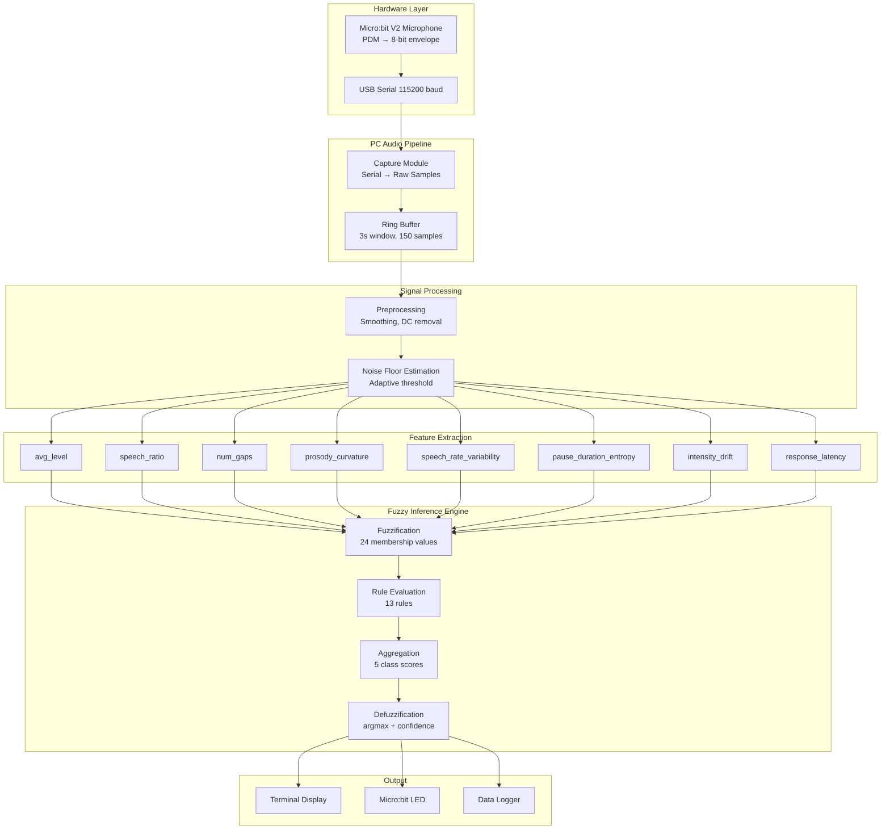

# System Architecture

## Overview
The SpeechAI system is a real-time, 5-class fuzzy logic speech classifier designed to run efficiently on an edge device (BBC micro:bit V2) paired with a PC. The system captures audio, extracts 8 acoustic features, and uses a Mamdani-style fuzzy inference engine to determine the speaker's mood.

## Architecture Diagram

## Hardware Layer
The BBC micro:bit V2 collects audio samples using its onboard microphone at 50Hz (20ms intervals). In PC Stream mode, these raw samples are sent over a 115200 baud USB serial connection to the PC. In standalone mode, basic feature extraction and a simplified 3-class fuzzy engine run directly on the micro:bit hardware.

## Audio Pipeline & Signal Processing
The PC receives the raw 8-bit unsigned integer samples. A `NoiseCalibration` system is used to dynamically detect the background noise floor, allowing the `features.py` module to set adaptive thresholds for soft Voice Activity Detection (VAD).

## Feature Extraction
Eight specific acoustic features are extracted:
1. `avg_level`: The mean amplitude of the audio signal.
2. `speech_ratio`: The proportion of samples classified as speech (soft VAD).
3. `num_gaps`: The number of discrete pauses during speech.
4. `prosody_curvature`: Measures the dynamic variation (second derivative) of the audio envelope.
5. `speech_rate_variability`: The standard deviation of the speaking rate over rolling windows.
6. `pause_duration_entropy`: The Shannon entropy of speech gap durations, identifying irregular pauses.
7. `intensity_drift`: The linear trend (slope) of volume over the sample window.
8. `response_latency`: The time elapsed before the first speech onset is detected.

## Fuzzy Inference Engine
The `fuzzy_engine.py` maps the extracted features to 5 classes:
- **Ambient Silence**
- **Confident Articulation**
- **Hesitant Disfluency**
- **Anxious Urgency**
- **Disengaged Monotone**

The engine evaluates 13 distinct rules mapping linguistic terms (LOW, MED, HIGH) across the 8 features, performing a `max` aggregation across applicable rules per class.
